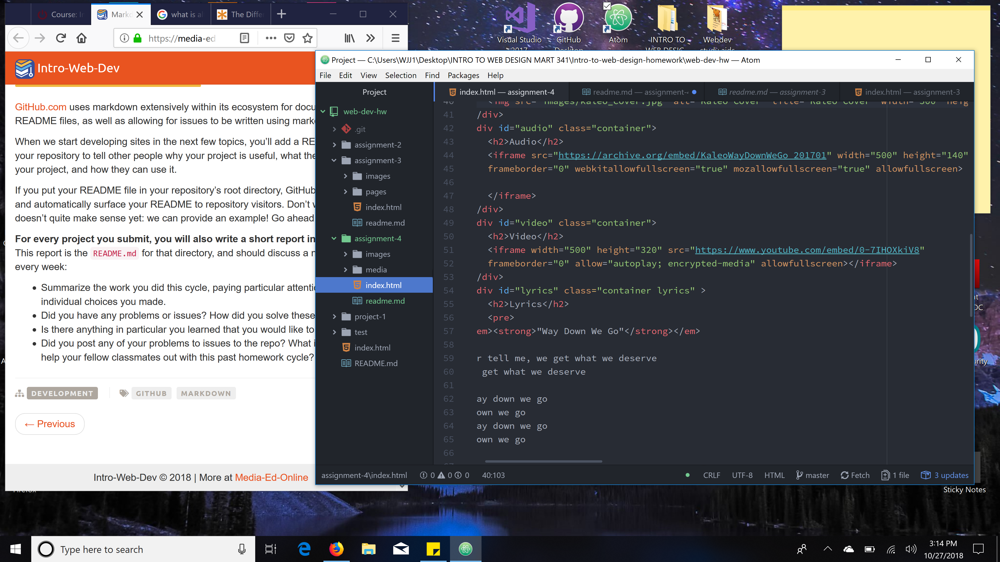

# Part 2: Technical Report
***
1. The div tag is a block level HTML element used to divide or section off other HTML tags in meaningful groups. A Span tag is an inline HTML element that is used to group a set of inline elements. The Id attribute is used to label sections or parts of your HTML document. Id's are unique. Each element can only have one Id, and each page can have only one element. The class attribute is not unique. You can use the same class on multiple elements, and you can use multiple classes on the same element.

2. The Alt text is a word or phrase that can be inserted as an attribute in a HTML document to tell web site viewers the nature of the contents of an image. The alt text appears in a blank box that would normally contain the image.

3. I went back and made sure that I embedded the google map correctly and made the width dimensions of the album art, audio player, and video player all the same to give the site a uniform look. I would have made the google map and media arts logo the same width as the video player, audio player, and album art but the dimensions for the media arts logo poster were stipulated, so I stuck with them. I made the google map the same width dimension as the media arts logo poster.  I initially had some trouble with the audio player showing up but not wanting to play the video. After some debugging I was able to get it to play the mp3 file from the hosted site. I am glad I finally was able to get this to work because I did not want to start all over looking for another song, art, video..etc.  At this point in time I have not had any issues to post nor have I been able to help any of my fellow classmates yet in this homework cycle.

