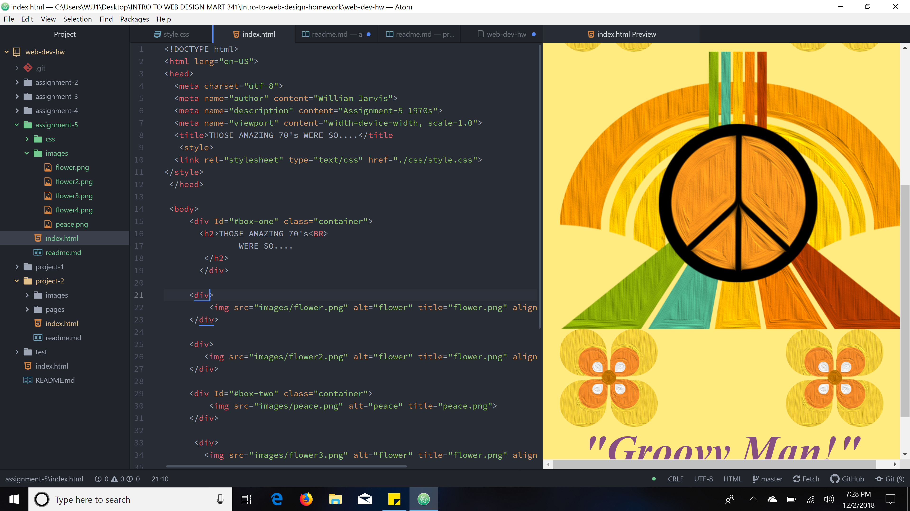

# Part 2: Technical Report
***
1. My design research was from the 1970s decade. I chose 3 of the graphics that were provided and then searched for a peace sign graphic that I could blend into my design. I then opened the graphics in Photoshop to create one main graphic design. I also matched the flower graphic to the main design. Although, the peace sign came out in the late 60s I used it for this project because the peace sign really became iconic during 70s decade.
2. My color palette is typical of 1970s earthtones that were a toned down version of many of the 60s bright colors. The reason behind this was because the Viet Nam War had America in turmoil, and designers of the time toned things down for a calming effect on the masses. Three colors I used are: OliveDrab: Hex#6B8E23, RGB(107,142,40), SaddleBrown: Hex#8B4513, RGB(139,69,19), Gold: Hex#FFD700, RGB(255,215,0).
3. My work cycle was to first study all the tutorials. I then picked the decade I wanted to use for this assignment. Then I designed the web page on paper so I had an Idea of what I wanted the web page to look like. After that I put together the main peace image in Photoshop and flower image. Once, I had the graphic images finished It took some time to figure out how I wanted to connect the stylesheet with the html index. That was the most difficult part of this assignment for me.

