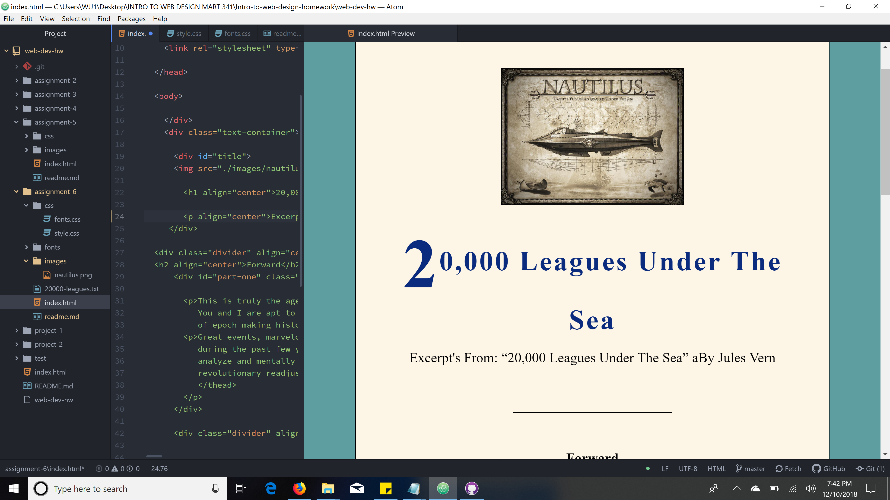

# Part 2: Technical Report
***
1. My design process was to design a web page that has the portrays that gives the reader a visual feeling about the content of the book through color, typography and design. I used playfair Display font, and Marck Script. My fallback font is Serif.
2. System fonts are already installed on a local device, they are not necessarily available to the web due to licensing.  Web Fonts are custom fonts hosted on a server. They do not have to be available on a user's device. However, they do require certain elements to get called up correctly.  Web-Safe Fonts are Fonts that Web Developers can count on being available for both Windows and Mac computers.
3.  My work cycle was pretty crazy for this assignment due to flu and high fever. I had to push myself to design an appealing site that fullfilled the requirements of the assignment on time.

