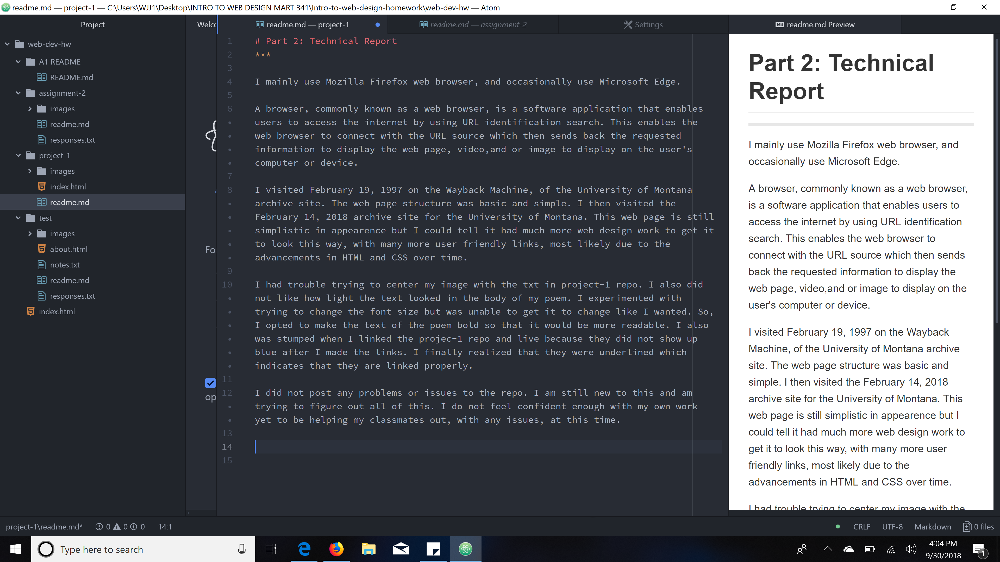

# Part 2: Technical Report
***

I mainly use Mozilla Firefox web browser, and occasionally use Microsoft Edge.

A browser, commonly known as a web browser, is a software application that enables users to access the internet by using URL identification search. This enables the web browser to connect with the URL source which then sends back the requested information to display the web page, video,and or image to display on the user's computer or device.

I visited February 19, 1997 on the Wayback Machine, of the University of Montana archive site. The web page structure was basic and simple. I then visited the  February 14, 2018 archive site for the University of Montana. This web page is still simplistic in appearence but I could tell it had much more web design work to get it to look this way, with many more user friendly links, most likely due to the advancements in HTML and CSS over time.

**Summary of Work Cycle**

I had trouble trying to center my image with the txt in project-1 repo. I also did not like how light the text looked in the body of my poem. I experimented with trying to change the font size but was unable to get it to change like I wanted. So, I opted to make the text of the poem bold so that it would be more readable. I also was stumped when I linked the projec-1 repo and live because they did not show up blue after I made the links. I finally realized that they were underlined which indicates that they are linked properly.

I did not post any problems or issues to the repo. I am still new to this and am trying to figure out all of this. I do not feel confident enough with my own work yet to be helping my classmates out, with any issues, at this time.

