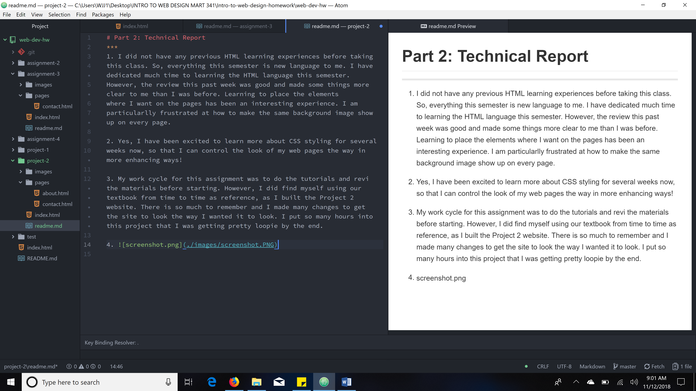

# Part 2: Technical Report
***
1. I did not have any previous HTML learning experiences before taking
this class. So, everything this semester is new language to me. I have dedicated much time to learning the HTML language this semester.
However, the review this past week was good and made some things more clear to me than I was before. Learning to place the elements
where I want on the pages has been an interesting experience. I am
particularlly frustrated at how to make the same background image show up on every page.

2. I have been excited to learn more about CSS styling for several
weeks now, so that I can control the look of my web pages the way in more enhancing ways!

3. My work cycle for this assignment was to do the tutorials and review  the materials before starting. Then it took me several
days to search the internet for a suitable Instructable project. Once I found a suitable project my goal was to create a website
that was easy to navigate through, has simple instructions, with large enough images and videos for the user to view. Function of
the website and a well presented Instructable were the priorities. Style was secondary but also important. I believe in order to
stimulate interest that the website should have a visual appeal as well. So, my goal with style was to have a background Image
that went along with the rustic theme of the Instructable. I tried several wood background images but none seemed to work. I chose the burlap background image because the texture makes the div's pop, drawing the eye to the content of each page. The color of the burlap helps blend the page together with the oldlace color of the div's. While working on the website I found it necessary look up different things in our textbook. I spend many hours on this project combing back through the pages and making necessary changes to either correct things or to hone it into a better more functional website.

 
