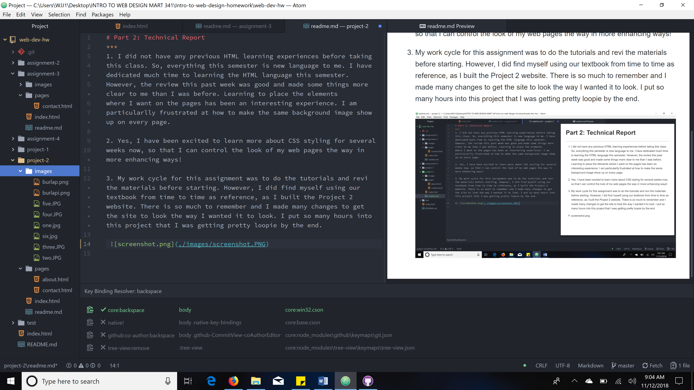

# Part 2: Technical Report
***
1. I did not have any previous HTML learning experiences before taking
this class. So, everything this semester is new language to me. I have dedicated much time to learning the HTML language this semester.
However, the review this past week was good and made some things more clear to me than I was before. Learning to place the elements
where I want on the pages has been an interesting experience. I am
particularlly frustrated at how to make the same background image show up on every page.

2. Yes, I have been excited to learn more about CSS styling for several
weeks now, so that I can control the look of my web pages the way in more enhancing ways!

3. My work cycle for this assignment was to do the tutorials and revi  the materials before starting. However, I did find myself using our textbook from time to time as reference, as I built the Project 2 website. There is so much to remember and I made many changes to get the site to look the way I wanted it to look. I put so many hours into this project that I was getting pretty loopie by the end.

 
