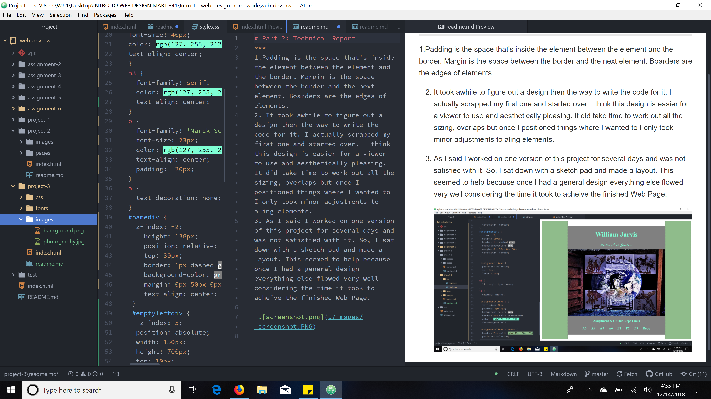

# Part 2: Technical Report
***
1.Padding is the space that's inside the element between the element and the border. Margin is the space between the border and the next element. Boarders are the edges of elements.
2. It took awhile to figure out a design then the way to write the code for it. I actually scrapped my first one and started over. I think this design is easier for a viewer to use and aesthetically pleasing. It did take time to work out all the sizing, overlaps but once I positioned things where I wanted to I only took minor adjustments to aling elements.
3. As I said I worked on one version of this project for several days and was not satisfied with it. So, I sat down with a sketch pad and made a layout. This seemed to help because once I had a general design everything else flowed very well considering the time it took to acheive the finished Web Page.

 
